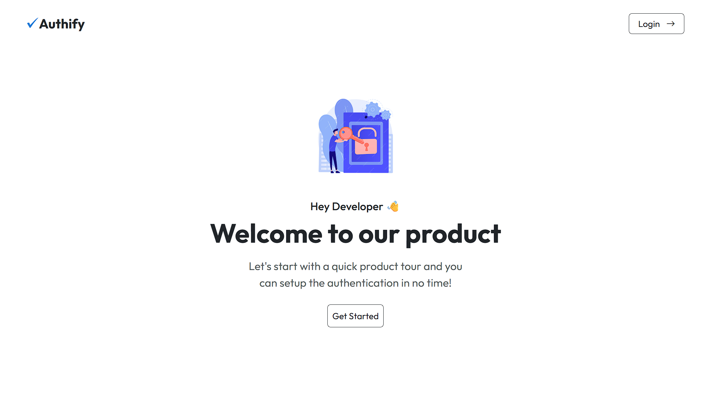
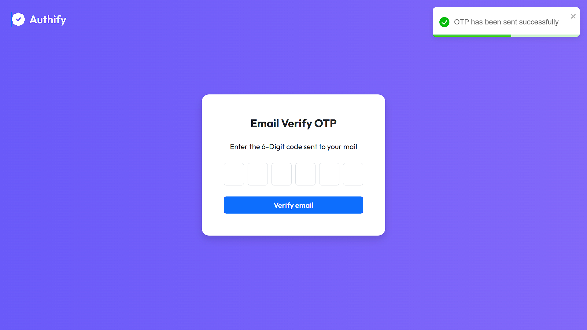
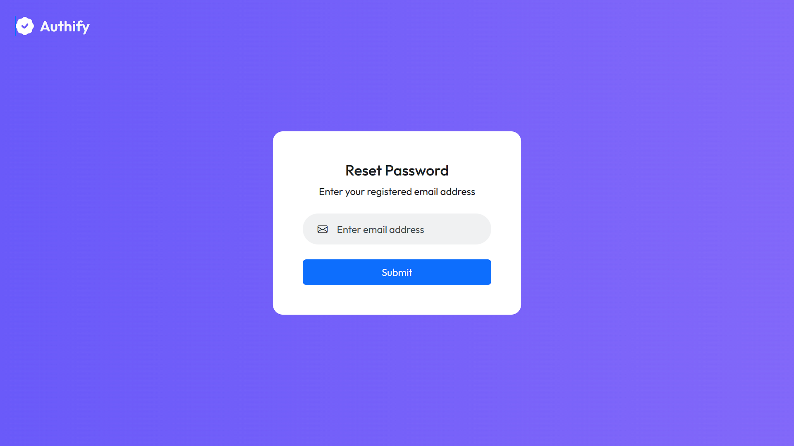
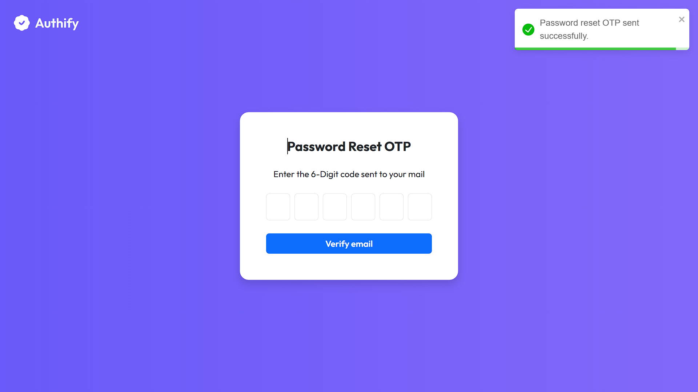
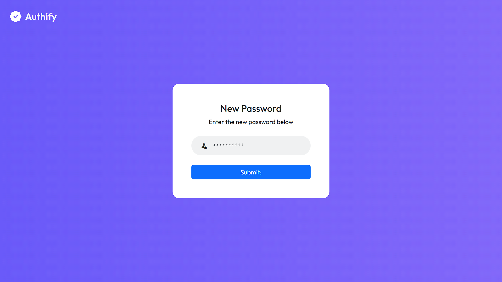
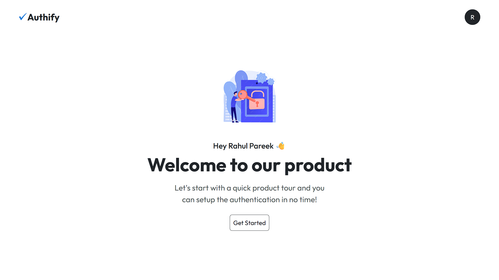
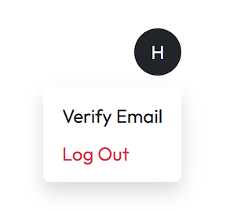

# 🔐 Full Stack Authentication System

A **production-grade full-stack authentication system** built using **React** and **Spring Boot**, implementing secure authentication, OTP-based email verification, and password reset flows used in real-world applications.

---

## 📌 Project Overview

This project focuses on **authentication, security, and real-world workflows** rather than just UI.

It demonstrates how modern applications handle:
- Secure login and session persistence
- Email verification using OTP
- Password reset using OTP
- Frontend–backend integration
- Clean authentication lifecycle

---

## 🧱 Tech Stack

### Frontend
- React (Vite)
- Context API
- Axios
- React Router
- Bootstrap

### Backend
- Spring Boot
- Spring Security
- JWT (JSON Web Tokens)
- Java Mail Sender
- Thymeleaf (HTML Email Templates)

### Database
- MySQL

---

## 📂 Project Structure
Full-Stack-Authentication-System/  
│  
├── authify/ # Spring Boot Backend  
│ ├── src/main/java  
│ ├── src/main/resources  
│ │ └── templates # Thymeleaf email templates  
│ └── pom.xml  
│  
├── client/ # React Frontend  
│ ├── src  
│ ├── public  
│ └── package.json  
│  
├── README.md  
└── .gitignore

---

## 🔐 Authentication Flow

1. User registers and logs in
2. Backend generates JWT and stores it in an **HTTP-only cookie**
3. User must verify email using OTP
4. After verification, full access is granted
5. On page refresh:
   - React state resets
   - Backend validates JWT
   - User session is restored automatically

---

### 🔥 First Look (Authify)

## ✉️ Email Verification (OTP)

- OTP is generated on the backend
- OTP is sent via **HTML email using Thymeleaf**
- User enters OTP on the frontend
- Backend verifies OTP and marks the account as verified
- Verified users are blocked from accessing the verify page via URL

### 📸 Verify Email Page (UI Preview)

---

## 🔁 Forgot Password Flow

1. User submits registered email
2. Backend sends password reset OTP
3. User enters OTP
4. User sets a new password
5. Backend validates OTP and updates password securely

### 📸 Reset Password Flow (UI Preview)

---

## 🏠 Home Page

- Displays logged-in user information
- Shows email verification status
- Option to verify email if not verified
- Secure logout functionality

### 📸 Home Page (UI Preview)

---

## 🛡️ Security Highlights

- JWT stored in **HTTP-only cookies**
- Protection against XSS attacks
- Sensitive configuration not committed to GitHub
- OTP expiry handling
- Frontend route protection
- Backend authentication filters

---

## ⚙️ Configuration Management

Sensitive data such as:
- Database credentials
- Email credentials
- JWT secret

are **not committed**.

Instead:
- `application.properties.example` is provided
- Actual `application.properties` is ignored using `.gitignore`

---

## 📧 Email Templates

Two professionally styled Thymeleaf templates:
- Email Verification OTP
- Password Reset OTP

These templates ensure a clean and user-friendly email experience.

---

## 🧠 Key Learnings

- JWT-based authentication
- Secure cookie handling
- OTP-based verification systems
- Auth persistence across refresh
- Frontend and backend security coordination
- Git best practices

---

## 👤 Author

**Rahul Pareek**  
Full-Stack Java Developer  

🔗 GitHub: https://github.com/rahulpareek011

---

## 🚀 Future Enhancements

- Role-based access control
- Refresh token implementation
- Dockerization
- Cloud deployment
- Rate limiting for OTP APIs

---

## ✅ Conclusion

This project demonstrates **real-world authentication system design**, focusing on security, scalability, and clean architecture rather than just UI.
